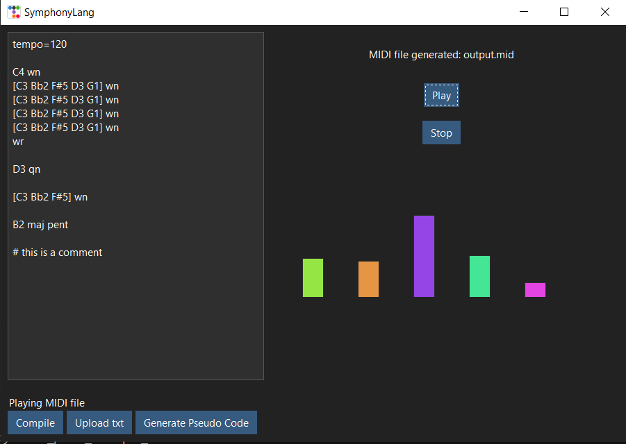

Here's a more concise version of your README.md while keeping the essential information:

# SymphonyLang
A simplified language for creating piano music that compiles to MIDI files. Features intuitive syntax for musical compositions with tempo control, notes, scales, chords, and rests.

## Basic Syntax

```
tempo=120    # set BPM
C4 qn        # note with duration
[C4 E4 G4] hn # chord
C4 maj        # scale
qr            # rest
```

### Notes
Format: `[Note][Accidental?][Octave] [Duration]`
- Notes: A-G
- Accidentals: # (sharp), b (flat)
- Durations: wn (whole), hn (half), qn (quarter), en (eighth), sn (sixteenth)

### Rests
- Format: `[Duration]r`
- Types: wr, hr, qr, er, sr

### Scales
Format: `[Root Note] [Scale Type] [Extension?]`
- Types: maj, min
- Extensions: pent, chrom

### Chords
Format: `[note1 note2 note3] duration`

Example:
```
[C4 E4 G4] wn
```

## GUI Features
- Text editor for code writing
- MIDI compilation and playback
- Real-time music visualization
- File management (upload/save)
- Error handling and status messages

## Example Code
```
tempo=120

C4 qn
E4 qn
G4 hn
C5 wn

C4 maj
[C4 E4 G4] wn
```

## Screenshots



